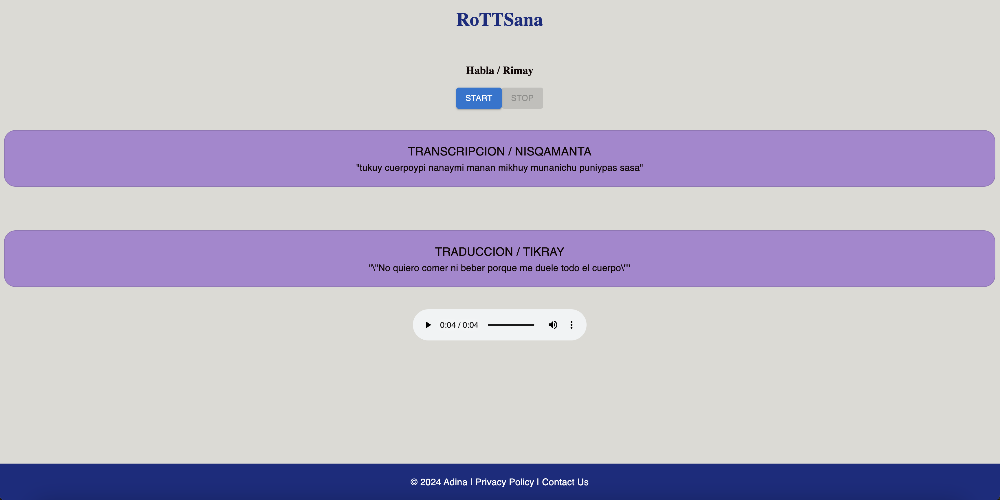

# RoTTSana 

### What is this?
RoTTSana is a real-time speech translator from Spanish to Quechua and viceversa.
It currently supports only Ayacucho Quechua.

### How does it work
1. Records the voice of the person talking
2. Makes a Speech-to-Text recognition 
3. Automatically identifies the language of the user
4. Translates the resultant text to the other language
5. The translated text is passed through a Text-to-Speech recognition
6. The generated audio is played automatically

### Tools and services
- Facebook MMS Models (STT: Multilanguage) https://huggingface.co/facebook/mms-1b-all
- Facebook MMS Models (TTS: Ayacucho Quechua Dialect) https://huggingface.co/facebook/mms-tts-quy
- Facebook MMS Models (TTS: Spanish)  https://huggingface.co/facebook/mms-tts-spa
- Facebook Translator Model   https://huggingface.co/facebook/nllb-200-distilled-600M

### Usage
1. Use your `base` Anaconda environment. 

    (If you don't know how to use Conda: https://docs.conda.io/projects/conda/en/stable/user-guide/index.html)

2. Run the endpoints inside the backend folder (first install all the requirements)

        cd backend
        pip install -r requirements.txt
        python endpoints.py
    
    
3. In another terminal run the frontend 

        cd frontend
        npm install
        npm start

### Demonstration

    